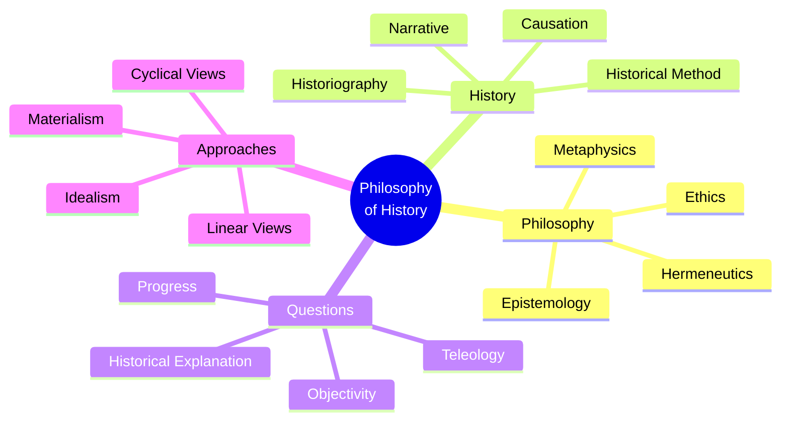

```mermaid
mindmap
  root((Philosophy<br/>of History))
    Philosophy
      Metaphysics
      Epistemology
      Ethics
      Hermeneutics
    History
      Historical Method
      Historiography
      Narrative
      Causation
    Questions
      Historical Explanation
      Progress
      Teleology
      Objectivity
    Approaches
      Idealism
      Materialism
      Cyclical Views
      Linear Views
```

