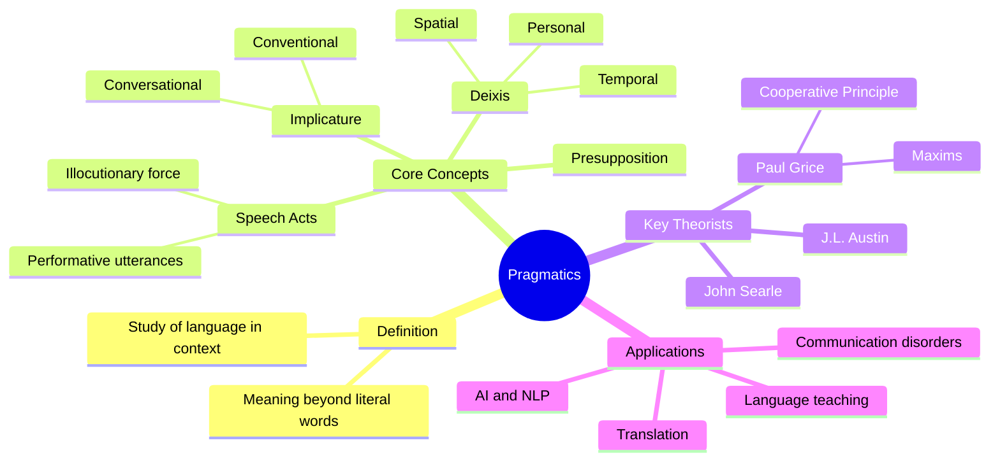

```mermaid
mindmap
  root((Pragmatics))
    Definition
      Study of language in context
      Meaning beyond literal words
    Core Concepts
      Speech Acts
        Performative utterances
        Illocutionary force
      Deixis
        Personal
        Spatial
        Temporal
      Implicature
        Conversational
        Conventional
      Presupposition
    Key Theorists
      Paul Grice
        Cooperative Principle
        Maxims
      J.L. Austin
      John Searle
    Applications
      Translation
      Language teaching
      Communication disorders
      AI and NLP
```

