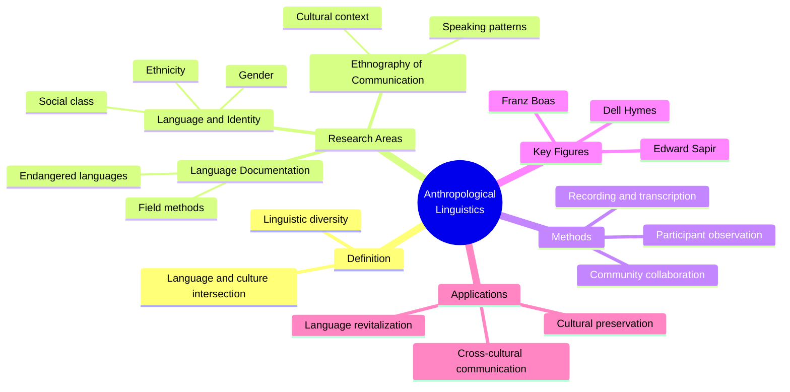

```mermaid
mindmap
  root((Anthropological<br/>Linguistics))
    Definition
      Language and culture intersection
      Linguistic diversity
    Research Areas
      Language and Identity
        Ethnicity
        Gender
        Social class
      Language Documentation
        Endangered languages
        Field methods
      Ethnography of Communication
        Speaking patterns
        Cultural context
    Methods
      Participant observation
      Recording and transcription
      Community collaboration
    Key Figures
      Franz Boas
      Edward Sapir
      Dell Hymes
    Applications
      Language revitalization
      Cultural preservation
      Cross-cultural communication
```

