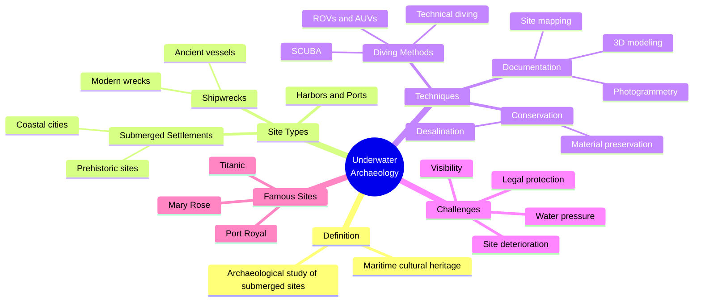

```mermaid
mindmap
  root((Underwater<br/>Archaeology))
    Definition
      Archaeological study of submerged sites
      Maritime cultural heritage
    Site Types
      Shipwrecks
        Ancient vessels
        Modern wrecks
      Submerged Settlements
        Prehistoric sites
        Coastal cities
      Harbors and Ports
    Techniques
      Diving Methods
        SCUBA
        Technical diving
        ROVs and AUVs
      Documentation
        Photogrammetry
        3D modeling
        Site mapping
      Conservation
        Desalination
        Material preservation
    Challenges
      Water pressure
      Visibility
      Site deterioration
      Legal protection
    Famous Sites
      Titanic
      Mary Rose
      Port Royal
```

