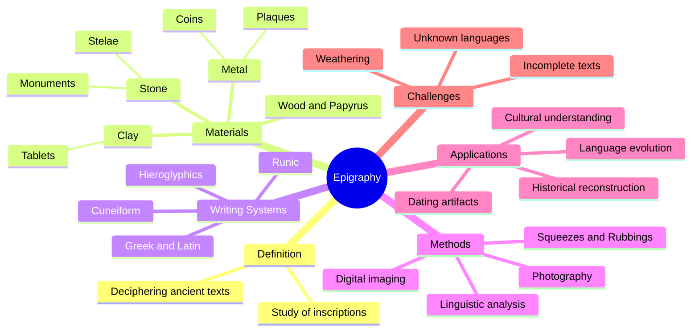

```mermaid
mindmap
  root((Epigraphy))
    Definition
      Study of inscriptions
      Deciphering ancient texts
    Materials
      Stone
        Monuments
        Stelae
      Metal
        Coins
        Plaques
      Clay
        Tablets
      Wood and Papyrus
    Writing Systems
      Cuneiform
      Hieroglyphics
      Greek and Latin
      Runic
    Methods
      Photography
      Squeezes and Rubbings
      Digital imaging
      Linguistic analysis
    Applications
      Dating artifacts
      Historical reconstruction
      Language evolution
      Cultural understanding
    Challenges
      Weathering
      Incomplete texts
      Unknown languages
```

