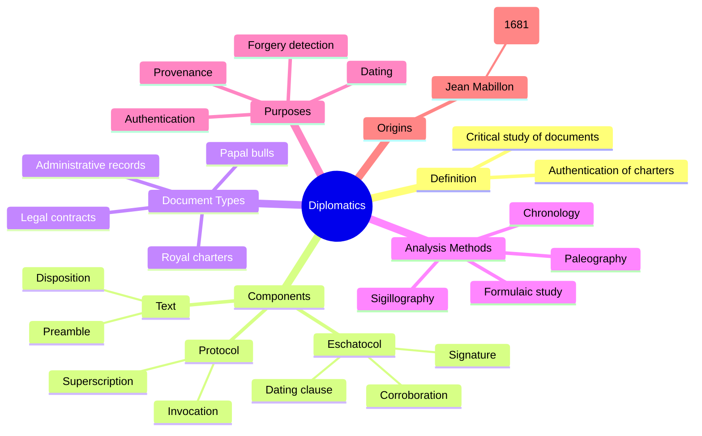

```mermaid
mindmap
  root((Diplomatics))
    Definition
      Critical study of documents
      Authentication of charters
    Components
      Protocol
        Invocation
        Superscription
      Text
        Preamble
        Disposition
      Eschatocol
        Corroboration
        Signature
        Dating clause
    Document Types
      Royal charters
      Papal bulls
      Legal contracts
      Administrative records
    Analysis Methods
      Paleography
      Sigillography
      Chronology
      Formulaic study
    Purposes
      Authentication
      Dating
      Provenance
      Forgery detection
    Origins
      Jean Mabillon
        De Re Diplomatica (1681)
```

