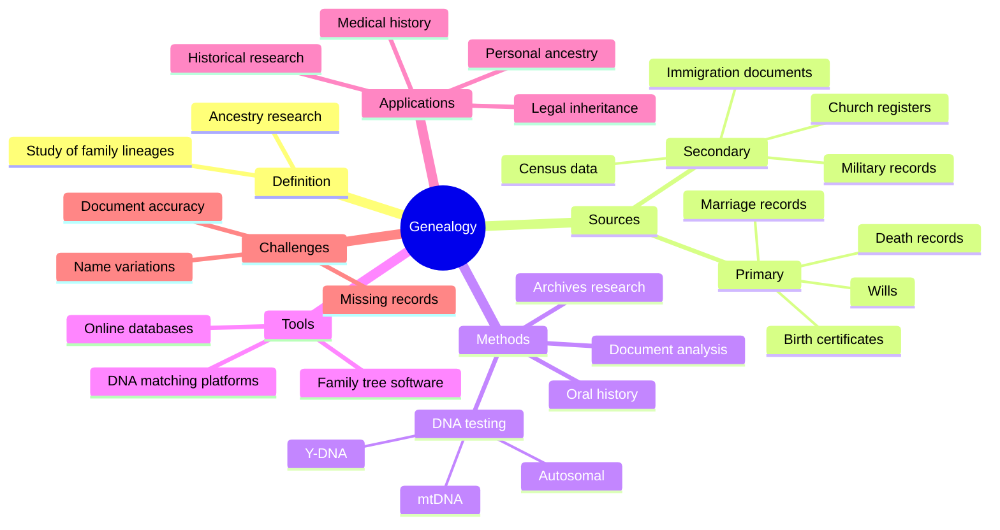

```mermaid
mindmap
  root((Genealogy))
    Definition
      Study of family lineages
      Ancestry research
    Sources
      Primary
        Birth certificates
        Marriage records
        Death records
        Wills
      Secondary
        Census data
        Church registers
        Military records
        Immigration documents
    Methods
      Document analysis
      DNA testing
        Autosomal
        Y-DNA
        mtDNA
      Oral history
      Archives research
    Tools
      Family tree software
      Online databases
      DNA matching platforms
    Applications
      Personal ancestry
      Medical history
      Legal inheritance
      Historical research
    Challenges
      Missing records
      Name variations
      Document accuracy
```

