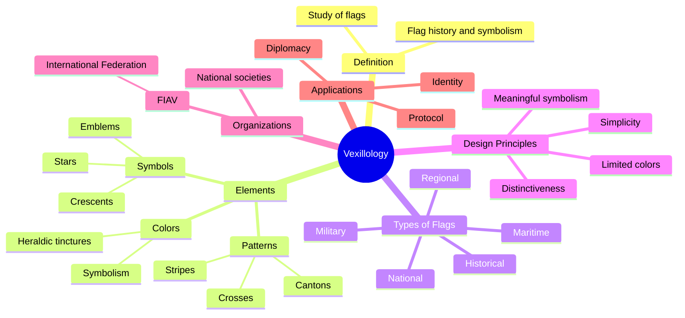

```mermaid
mindmap
  root((Vexillology))
    Definition
      Study of flags
      Flag history and symbolism
    Elements
      Colors
        Symbolism
        Heraldic tinctures
      Patterns
        Stripes
        Crosses
        Cantons
      Symbols
        Stars
        Crescents
        Emblems
    Types of Flags
      National
      Regional
      Military
      Maritime
      Historical
    Design Principles
      Simplicity
      Meaningful symbolism
      Limited colors
      Distinctiveness
    Organizations
      FIAV
        International Federation
      National societies
    Applications
      Protocol
      Identity
      Diplomacy
```

