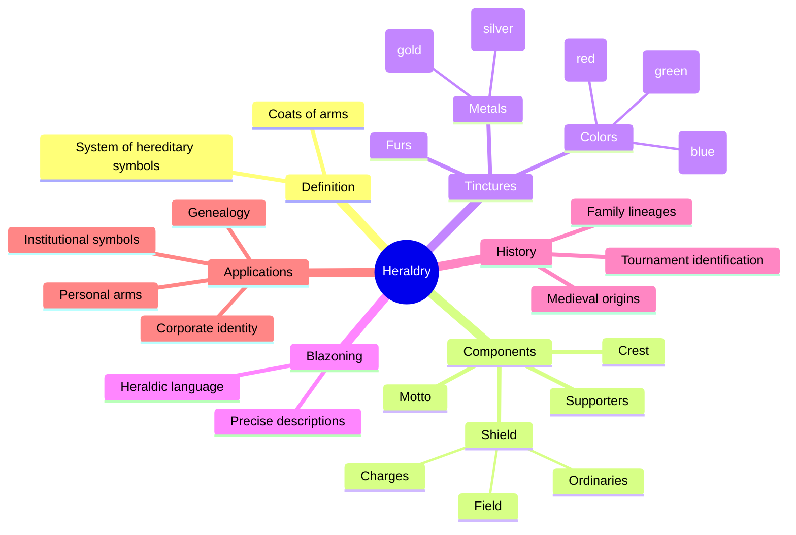

```mermaid
mindmap
  root((Heraldry))
    Definition
      System of hereditary symbols
      Coats of arms
    Components
      Shield
        Field
        Charges
        Ordinaries
      Crest
      Supporters
      Motto
    Tinctures
      Metals
        Or (gold)
        Argent (silver)
      Colors
        Gules (red)
        Azure (blue)
        Vert (green)
      Furs
    Blazoning
      Heraldic language
      Precise descriptions
    History
      Medieval origins
      Tournament identification
      Family lineages
    Applications
      Genealogy
      Corporate identity
      Institutional symbols
      Personal arms
```

