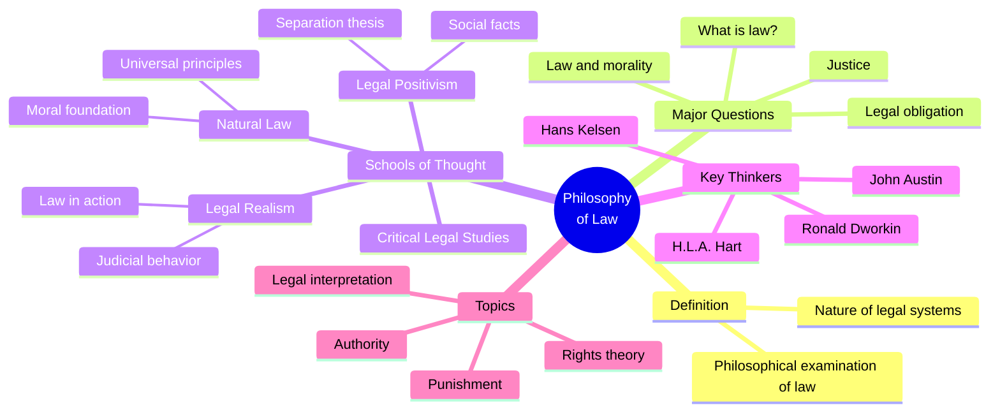

```mermaid
mindmap
  root((Philosophy<br/>of Law))
    Definition
      Philosophical examination of law
      Nature of legal systems
    Major Questions
      What is law?
      Law and morality
      Legal obligation
      Justice
    Schools of Thought
      Natural Law
        Universal principles
        Moral foundation
      Legal Positivism
        Separation thesis
        Social facts
      Legal Realism
        Law in action
        Judicial behavior
      Critical Legal Studies
    Key Thinkers
      H.L.A. Hart
      Ronald Dworkin
      Hans Kelsen
      John Austin
    Topics
      Rights theory
      Legal interpretation
      Punishment
      Authority
```

