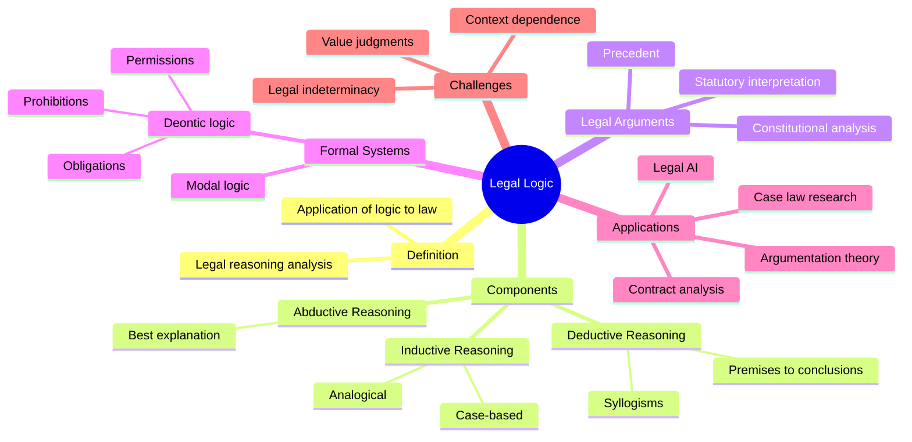

```mermaid
mindmap
  root((Legal Logic))
    Definition
      Application of logic to law
      Legal reasoning analysis
    Components
      Deductive Reasoning
        Syllogisms
        Premises to conclusions
      Inductive Reasoning
        Case-based
        Analogical
      Abductive Reasoning
        Best explanation
    Legal Arguments
      Precedent
      Statutory interpretation
      Constitutional analysis
    Formal Systems
      Deontic logic
        Obligations
        Permissions
        Prohibitions
      Modal logic
    Applications
      Legal AI
      Contract analysis
      Case law research
      Argumentation theory
    Challenges
      Legal indeterminacy
      Value judgments
      Context dependence
```

