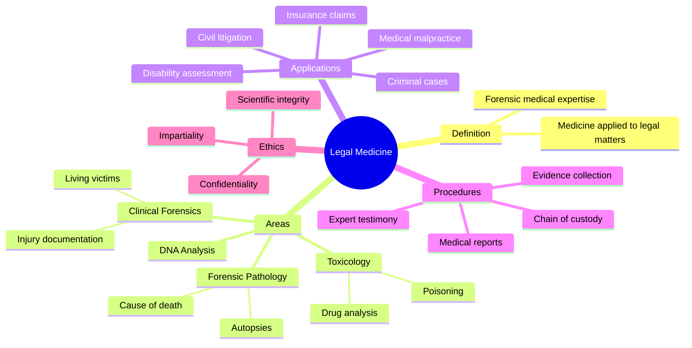

```mermaid
mindmap
  root((Legal Medicine))
    Definition
      Medicine applied to legal matters
      Forensic medical expertise
    Areas
      Forensic Pathology
        Autopsies
        Cause of death
      Clinical Forensics
        Living victims
        Injury documentation
      Toxicology
        Poisoning
        Drug analysis
      DNA Analysis
    Applications
      Criminal cases
      Civil litigation
      Medical malpractice
      Disability assessment
      Insurance claims
    Procedures
      Evidence collection
      Expert testimony
      Medical reports
      Chain of custody
    Ethics
      Confidentiality
      Impartiality
      Scientific integrity
```

