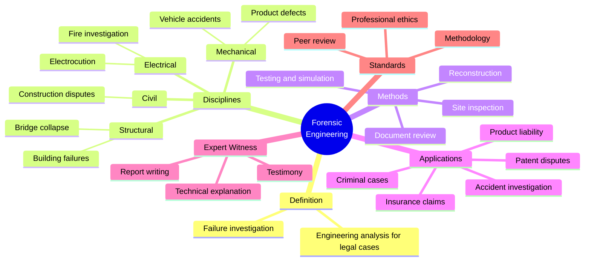

```mermaid
mindmap
  root((Forensic<br/>Engineering))
    Definition
      Engineering analysis for legal cases
      Failure investigation
    Disciplines
      Structural
        Building failures
        Bridge collapse
      Mechanical
        Vehicle accidents
        Product defects
      Electrical
        Fire investigation
        Electrocution
      Civil
        Construction disputes
    Methods
      Site inspection
      Document review
      Testing and simulation
      Reconstruction
    Applications
      Accident investigation
      Product liability
      Insurance claims
      Criminal cases
      Patent disputes
    Expert Witness
      Report writing
      Testimony
      Technical explanation
    Standards
      Professional ethics
      Methodology
      Peer review
```

