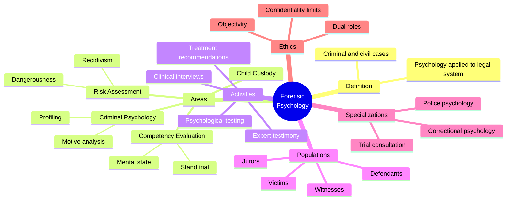

```mermaid
mindmap
  root((Forensic<br/>Psychology))
    Definition
      Psychology applied to legal system
      Criminal and civil cases
    Areas
      Criminal Psychology
        Profiling
        Motive analysis
      Competency Evaluation
        Stand trial
        Mental state
      Risk Assessment
        Recidivism
        Dangerousness
      Child Custody
    Activities
      Psychological testing
      Clinical interviews
      Expert testimony
      Treatment recommendations
    Populations
      Defendants
      Victims
      Witnesses
      Jurors
    Specializations
      Police psychology
      Correctional psychology
      Trial consultation
    Ethics
      Dual roles
      Confidentiality limits
      Objectivity
```

