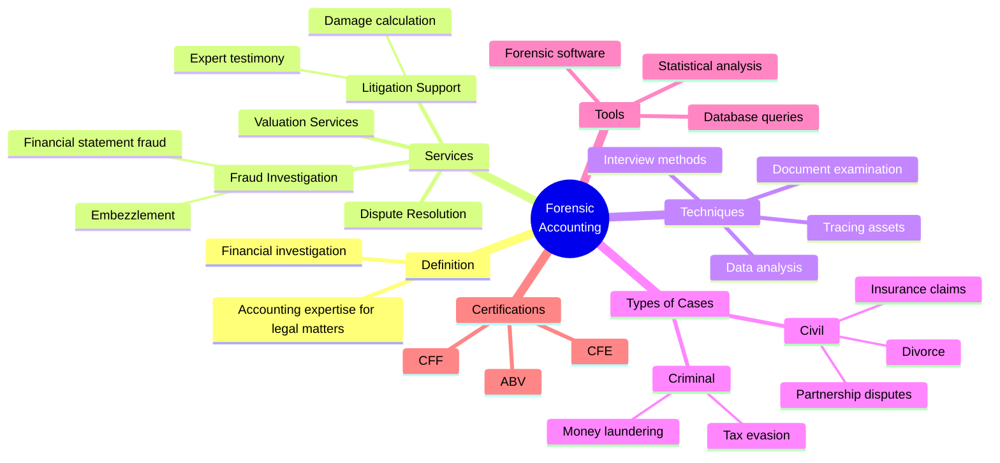

```mermaid
mindmap
  root((Forensic<br/>Accounting))
    Definition
      Accounting expertise for legal matters
      Financial investigation
    Services
      Fraud Investigation
        Embezzlement
        Financial statement fraud
      Litigation Support
        Damage calculation
        Expert testimony
      Dispute Resolution
      Valuation Services
    Techniques
      Data analysis
      Document examination
      Interview methods
      Tracing assets
    Types of Cases
      Criminal
        Money laundering
        Tax evasion
      Civil
        Divorce
        Partnership disputes
        Insurance claims
    Tools
      Forensic software
      Statistical analysis
      Database queries
    Certifications
      CFE
      CFF
      ABV
```

