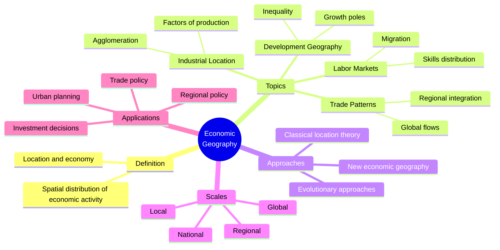

```mermaid
mindmap
  root((Economic<br/>Geography))
    Definition
      Spatial distribution of economic activity
      Location and economy
    Topics
      Industrial Location
        Factors of production
        Agglomeration
      Trade Patterns
        Global flows
        Regional integration
      Development Geography
        Inequality
        Growth poles
      Labor Markets
        Migration
        Skills distribution
    Approaches
      Classical location theory
      New economic geography
      Evolutionary approaches
    Scales
      Local
      Regional
      National
      Global
    Applications
      Urban planning
      Regional policy
      Investment decisions
      Trade policy
```

