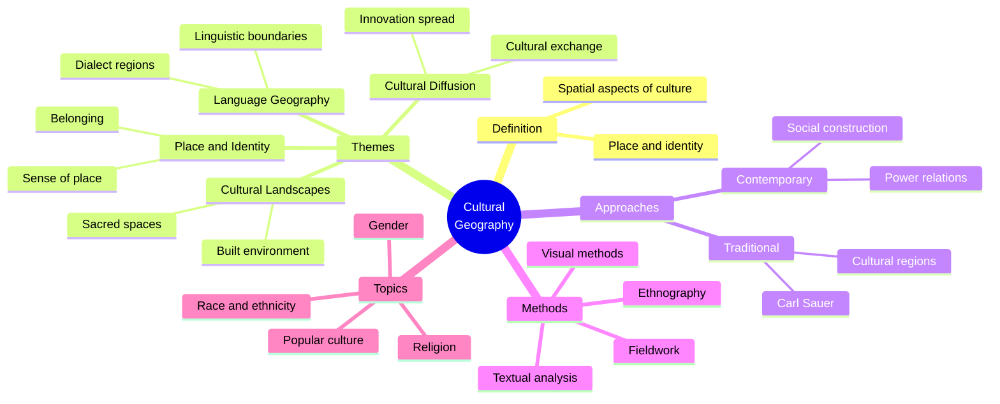

```mermaid
mindmap
  root((Cultural<br/>Geography))
    Definition
      Spatial aspects of culture
      Place and identity
    Themes
      Cultural Landscapes
        Built environment
        Sacred spaces
      Place and Identity
        Sense of place
        Belonging
      Cultural Diffusion
        Innovation spread
        Cultural exchange
      Language Geography
        Dialect regions
        Linguistic boundaries
    Approaches
      Traditional
        Carl Sauer
        Cultural regions
      Contemporary
        Social construction
        Power relations
    Methods
      Fieldwork
      Ethnography
      Textual analysis
      Visual methods
    Topics
      Race and ethnicity
      Gender
      Religion
      Popular culture
```

