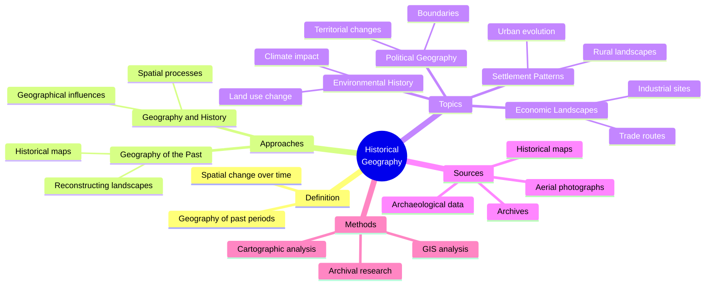

```mermaid
mindmap
  root((Historical<br/>Geography))
    Definition
      Geography of past periods
      Spatial change over time
    Approaches
      Geography of the Past
        Reconstructing landscapes
        Historical maps
      Geography and History
        Geographical influences
        Spatial processes
    Topics
      Settlement Patterns
        Urban evolution
        Rural landscapes
      Economic Landscapes
        Trade routes
        Industrial sites
      Political Geography
        Boundaries
        Territorial changes
      Environmental History
        Land use change
        Climate impact
    Sources
      Historical maps
      Archives
      Archaeological data
      Aerial photographs
    Methods
      GIS analysis
      Cartographic analysis
      Archival research
```

