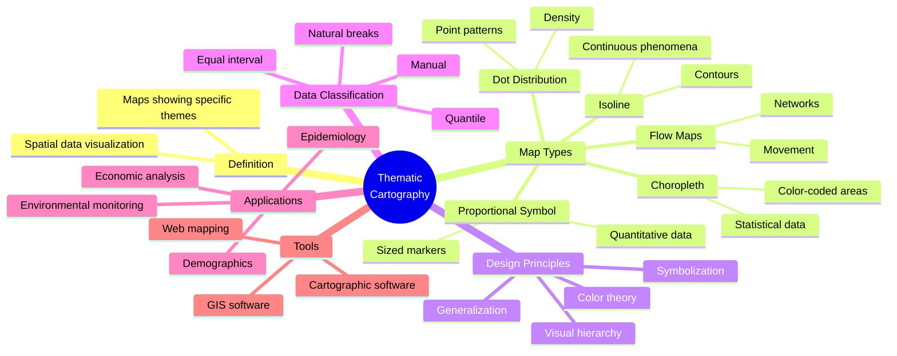

```mermaid
mindmap
  root((Thematic<br/>Cartography))
    Definition
      Maps showing specific themes
      Spatial data visualization
    Map Types
      Choropleth
        Color-coded areas
        Statistical data
      Dot Distribution
        Point patterns
        Density
      Proportional Symbol
        Sized markers
        Quantitative data
      Isoline
        Contours
        Continuous phenomena
      Flow Maps
        Movement
        Networks
    Design Principles
      Visual hierarchy
      Color theory
      Symbolization
      Generalization
    Data Classification
      Equal interval
      Quantile
      Natural breaks
      Manual
    Applications
      Demographics
      Epidemiology
      Environmental monitoring
      Economic analysis
    Tools
      GIS software
      Cartographic software
      Web mapping
```

