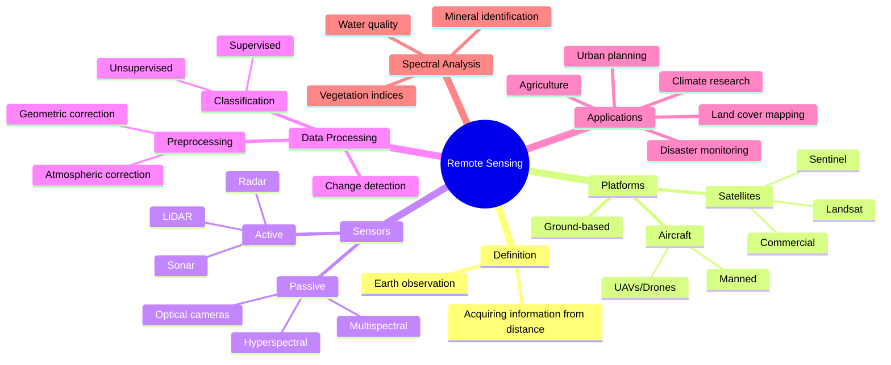

```mermaid
mindmap
  root((Remote Sensing))
    Definition
      Acquiring information from distance
      Earth observation
    Platforms
      Satellites
        Landsat
        Sentinel
        Commercial
      Aircraft
        Manned
        UAVs/Drones
      Ground-based
    Sensors
      Passive
        Optical cameras
        Multispectral
        Hyperspectral
      Active
        Radar
        LiDAR
        Sonar
    Data Processing
      Preprocessing
        Geometric correction
        Atmospheric correction
      Classification
        Supervised
        Unsupervised
      Change detection
    Applications
      Land cover mapping
      Agriculture
      Disaster monitoring
      Climate research
      Urban planning
    Spectral Analysis
      Vegetation indices
      Water quality
      Mineral identification
```

