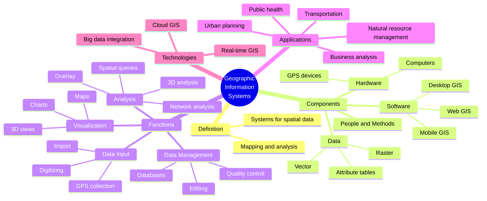

```mermaid
mindmap
  root((Geographic<br/>Information<br/>Systems))
    Definition
      Systems for spatial data
      Mapping and analysis
    Components
      Hardware
        Computers
        GPS devices
      Software
        Desktop GIS
        Web GIS
        Mobile GIS
      Data
        Vector
        Raster
        Attribute tables
      People and Methods
    Functions
      Data Input
        Digitizing
        GPS collection
        Import
      Data Management
        Databases
        Editing
        Quality control
      Analysis
        Spatial queries
        Overlay
        Network analysis
        3D analysis
      Visualization
        Maps
        Charts
        3D views
    Applications
      Urban planning
      Natural resource management
      Public health
      Transportation
      Business analysis
    Technologies
      Cloud GIS
      Real-time GIS
      Big data integration
```

