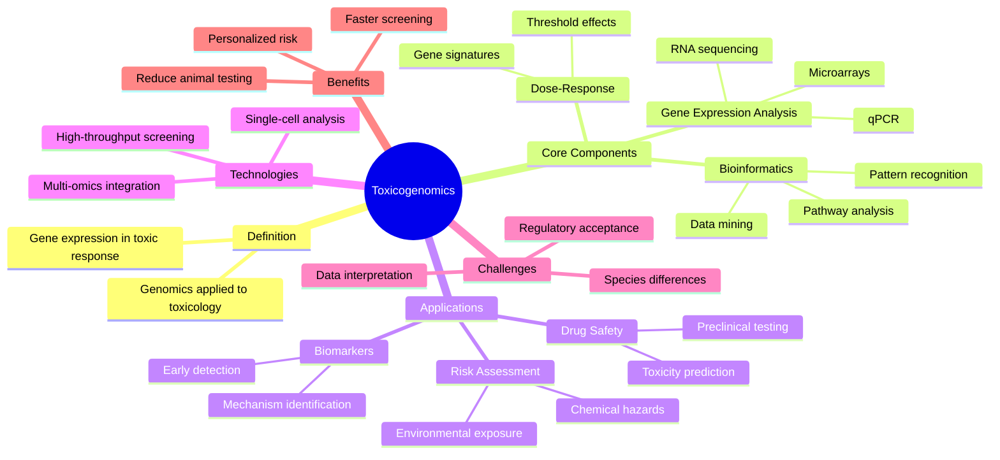

```mermaid
mindmap
  root((Toxicogenomics))
    Definition
      Gene expression in toxic response
      Genomics applied to toxicology
    Core Components
      Gene Expression Analysis
        Microarrays
        RNA sequencing
        qPCR
      Bioinformatics
        Data mining
        Pattern recognition
        Pathway analysis
      Dose-Response
        Gene signatures
        Threshold effects
    Applications
      Drug Safety
        Preclinical testing
        Toxicity prediction
      Risk Assessment
        Chemical hazards
        Environmental exposure
      Biomarkers
        Early detection
        Mechanism identification
    Technologies
      High-throughput screening
      Single-cell analysis
      Multi-omics integration
    Challenges
      Data interpretation
      Species differences
      Regulatory acceptance
    Benefits
      Reduce animal testing
      Personalized risk
      Faster screening
```

