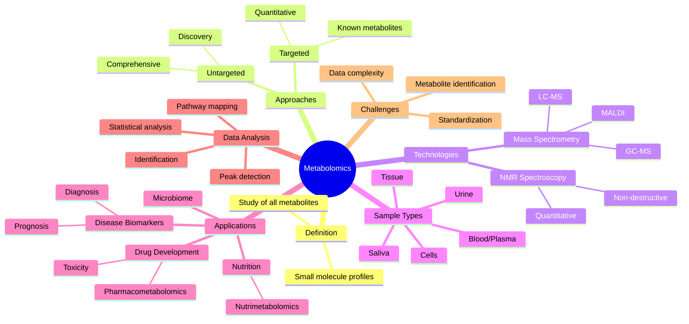

```mermaid
mindmap
  root((Metabolomics))
    Definition
      Study of all metabolites
      Small molecule profiles
    Approaches
      Targeted
        Known metabolites
        Quantitative
      Untargeted
        Discovery
        Comprehensive
    Technologies
      Mass Spectrometry
        LC-MS
        GC-MS
        MALDI
      NMR Spectroscopy
        Non-destructive
        Quantitative
    Sample Types
      Blood/Plasma
      Urine
      Tissue
      Cells
      Saliva
    Applications
      Disease Biomarkers
        Diagnosis
        Prognosis
      Drug Development
        Pharmacometabolomics
        Toxicity
      Nutrition
        Nutrimetabolomics
      Microbiome
    Data Analysis
      Peak detection
      Identification
      Statistical analysis
      Pathway mapping
    Challenges
      Metabolite identification
      Standardization
      Data complexity
```

