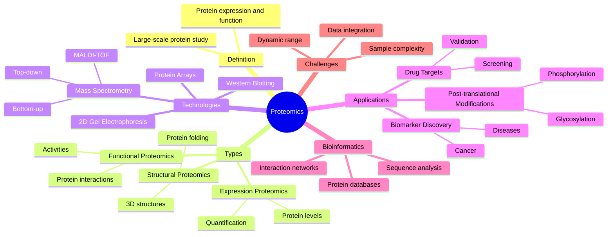

```mermaid
mindmap
  root((Proteomics))
    Definition
      Large-scale protein study
      Protein expression and function
    Types
      Expression Proteomics
        Protein levels
        Quantification
      Structural Proteomics
        3D structures
        Protein folding
      Functional Proteomics
        Protein interactions
        Activities
    Technologies
      Mass Spectrometry
        Bottom-up
        Top-down
        MALDI-TOF
      2D Gel Electrophoresis
      Protein Arrays
      Western Blotting
    Applications
      Biomarker Discovery
        Cancer
        Diseases
      Drug Targets
        Validation
        Screening
      Post-translational Modifications
        Phosphorylation
        Glycosylation
    Bioinformatics
      Protein databases
      Sequence analysis
      Interaction networks
    Challenges
      Dynamic range
      Sample complexity
      Data integration
```

