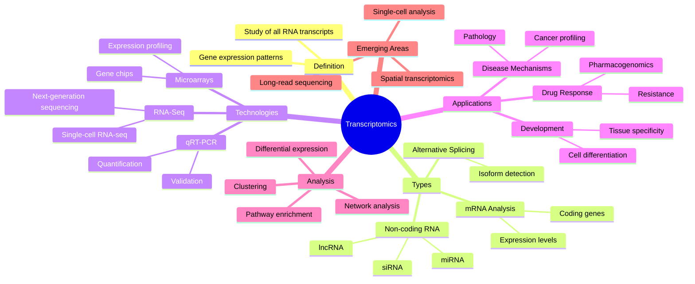

```mermaid
mindmap
  root((Transcriptomics))
    Definition
      Study of all RNA transcripts
      Gene expression patterns
    Types
      mRNA Analysis
        Coding genes
        Expression levels
      Non-coding RNA
        miRNA
        lncRNA
        siRNA
      Alternative Splicing
        Isoform detection
    Technologies
      RNA-Seq
        Next-generation sequencing
        Single-cell RNA-seq
      Microarrays
        Gene chips
        Expression profiling
      qRT-PCR
        Validation
        Quantification
    Applications
      Disease Mechanisms
        Cancer profiling
        Pathology
      Drug Response
        Pharmacogenomics
        Resistance
      Development
        Cell differentiation
        Tissue specificity
    Analysis
      Differential expression
      Pathway enrichment
      Network analysis
      Clustering
    Emerging Areas
      Spatial transcriptomics
      Single-cell analysis
      Long-read sequencing
```

