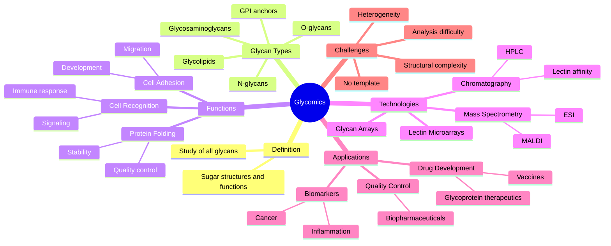

```mermaid
mindmap
  root((Glycomics))
    Definition
      Study of all glycans
      Sugar structures and functions
    Glycan Types
      N-glycans
      O-glycans
      Glycolipids
      Glycosaminoglycans
      GPI anchors
    Functions
      Cell Recognition
        Immune response
        Signaling
      Protein Folding
        Stability
        Quality control
      Cell Adhesion
        Migration
        Development
    Technologies
      Mass Spectrometry
        MALDI
        ESI
      Chromatography
        HPLC
        Lectin affinity
      Glycan Arrays
      Lectin Microarrays
    Applications
      Biomarkers
        Cancer
        Inflammation
      Drug Development
        Glycoprotein therapeutics
        Vaccines
      Quality Control
        Biopharmaceuticals
    Challenges
      Structural complexity
      Heterogeneity
      Analysis difficulty
      No template
```

