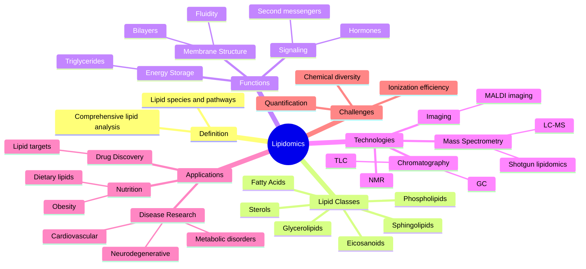

```mermaid
mindmap
  root((Lipidomics))
    Definition
      Comprehensive lipid analysis
      Lipid species and pathways
    Lipid Classes
      Fatty Acids
      Glycerolipids
      Phospholipids
      Sphingolipids
      Sterols
      Eicosanoids
    Functions
      Membrane Structure
        Bilayers
        Fluidity
      Energy Storage
        Triglycerides
      Signaling
        Second messengers
        Hormones
    Technologies
      Mass Spectrometry
        Shotgun lipidomics
        LC-MS
      Chromatography
        TLC
        GC
      NMR
      Imaging
        MALDI imaging
    Applications
      Disease Research
        Metabolic disorders
        Cardiovascular
        Neurodegenerative
      Nutrition
        Dietary lipids
        Obesity
      Drug Discovery
        Lipid targets
    Challenges
      Chemical diversity
      Ionization efficiency
      Quantification
```

