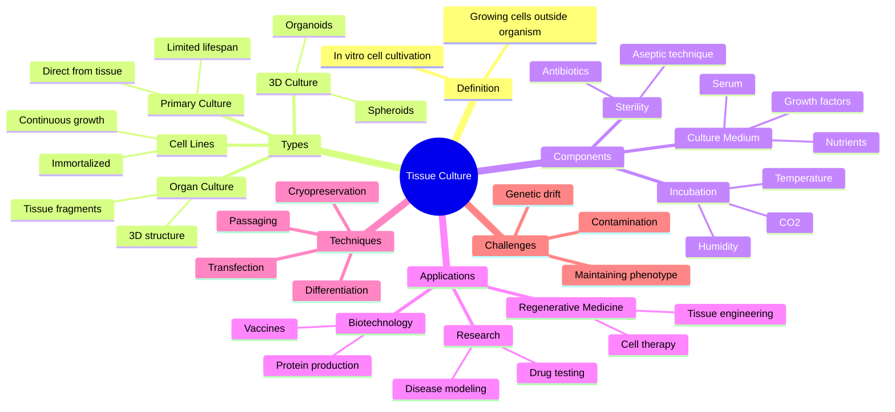

```mermaid
mindmap
  root((Tissue Culture))
    Definition
      Growing cells outside organism
      In vitro cell cultivation
    Types
      Primary Culture
        Direct from tissue
        Limited lifespan
      Cell Lines
        Immortalized
        Continuous growth
      Organ Culture
        Tissue fragments
        3D structure
      3D Culture
        Spheroids
        Organoids
    Components
      Culture Medium
        Nutrients
        Growth factors
        Serum
      Incubation
        Temperature
        CO2
        Humidity
      Sterility
        Aseptic technique
        Antibiotics
    Applications
      Research
        Disease modeling
        Drug testing
      Biotechnology
        Protein production
        Vaccines
      Regenerative Medicine
        Tissue engineering
        Cell therapy
    Techniques
      Passaging
      Cryopreservation
      Transfection
      Differentiation
    Challenges
      Contamination
      Genetic drift
      Maintaining phenotype
```

