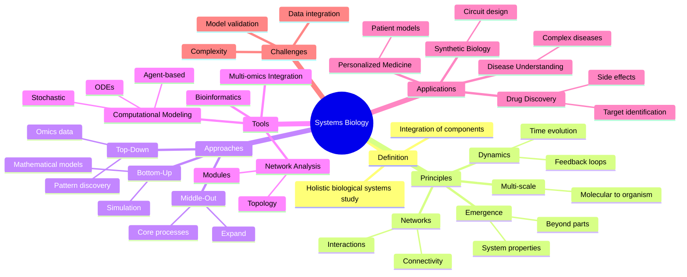

```mermaid
mindmap
  root((Systems Biology))
    Definition
      Holistic biological systems study
      Integration of components
    Principles
      Emergence
        System properties
        Beyond parts
      Networks
        Interactions
        Connectivity
      Dynamics
        Time evolution
        Feedback loops
      Multi-scale
        Molecular to organism
    Approaches
      Top-Down
        Omics data
        Pattern discovery
      Bottom-Up
        Mathematical models
        Simulation
      Middle-Out
        Core processes
        Expand
    Tools
      Computational Modeling
        ODEs
        Agent-based
        Stochastic
      Network Analysis
        Topology
        Modules
      Multi-omics Integration
      Bioinformatics
    Applications
      Drug Discovery
        Target identification
        Side effects
      Synthetic Biology
        Circuit design
      Personalized Medicine
        Patient models
      Disease Understanding
        Complex diseases
    Challenges
      Data integration
      Model validation
      Complexity
```

