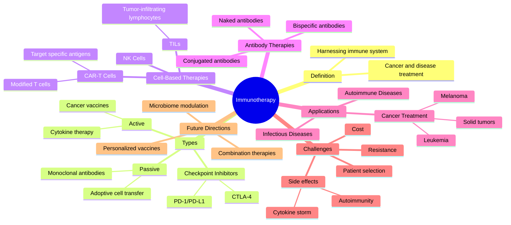

```mermaid
mindmap
  root((Immunotherapy))
    Definition
      Harnessing immune system
      Cancer and disease treatment
    Types
      Active
        Cancer vaccines
        Cytokine therapy
      Passive
        Monoclonal antibodies
        Adoptive cell transfer
      Checkpoint Inhibitors
        PD-1/PD-L1
        CTLA-4
    Cell-Based Therapies
      CAR-T Cells
        Modified T cells
        Target specific antigens
      TILs
        Tumor-infiltrating lymphocytes
      NK Cells
    Antibody Therapies
      Naked antibodies
      Conjugated antibodies
      Bispecific antibodies
    Applications
      Cancer Treatment
        Melanoma
        Leukemia
        Solid tumors
      Autoimmune Diseases
      Infectious Diseases
    Challenges
      Side effects
        Cytokine storm
        Autoimmunity
      Resistance
      Cost
      Patient selection
    Future Directions
      Combination therapies
      Personalized vaccines
      Microbiome modulation
```

