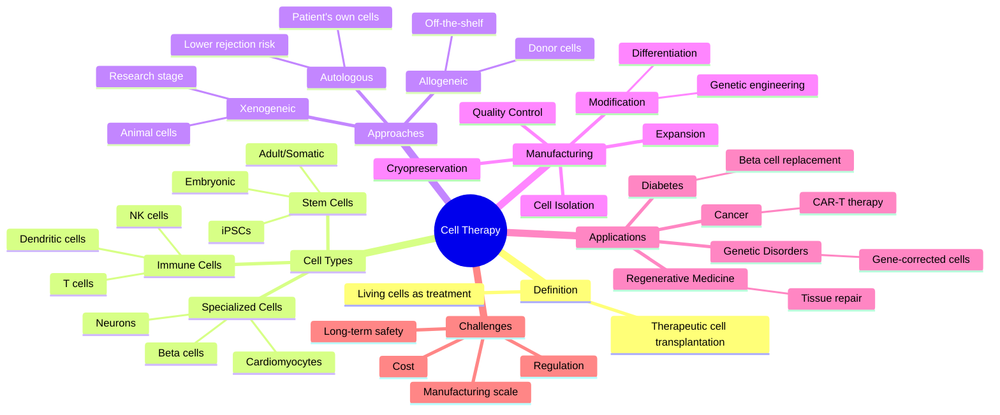

```mermaid
mindmap
  root((Cell Therapy))
    Definition
      Living cells as treatment
      Therapeutic cell transplantation
    Cell Types
      Stem Cells
        Embryonic
        Adult/Somatic
        iPSCs
      Immune Cells
        T cells
        NK cells
        Dendritic cells
      Specialized Cells
        Neurons
        Cardiomyocytes
        Beta cells
    Approaches
      Autologous
        Patient's own cells
        Lower rejection risk
      Allogeneic
        Donor cells
        Off-the-shelf
      Xenogeneic
        Animal cells
        Research stage
    Manufacturing
      Cell Isolation
      Expansion
      Modification
        Genetic engineering
        Differentiation
      Quality Control
      Cryopreservation
    Applications
      Cancer
        CAR-T therapy
      Regenerative Medicine
        Tissue repair
      Genetic Disorders
        Gene-corrected cells
      Diabetes
        Beta cell replacement
    Challenges
      Manufacturing scale
      Cost
      Regulation
      Long-term safety
```

