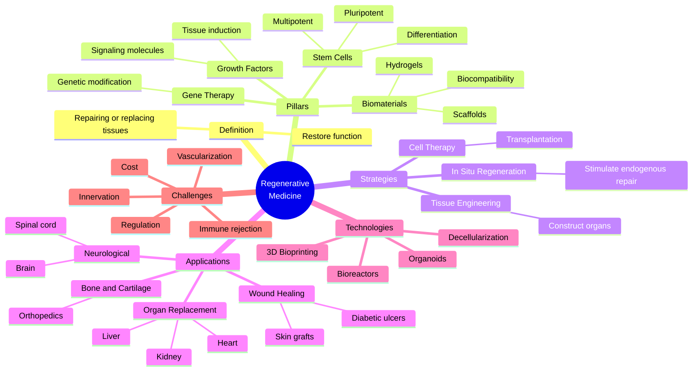

```mermaid
mindmap
  root((Regenerative<br/>Medicine))
    Definition
      Repairing or replacing tissues
      Restore function
    Pillars
      Stem Cells
        Pluripotent
        Multipotent
        Differentiation
      Biomaterials
        Scaffolds
        Hydrogels
        Biocompatibility
      Growth Factors
        Signaling molecules
        Tissue induction
      Gene Therapy
        Genetic modification
    Strategies
      Cell Therapy
        Transplantation
      Tissue Engineering
        Construct organs
      In Situ Regeneration
        Stimulate endogenous repair
    Applications
      Organ Replacement
        Heart
        Liver
        Kidney
      Wound Healing
        Skin grafts
        Diabetic ulcers
      Bone and Cartilage
        Orthopedics
      Neurological
        Spinal cord
        Brain
    Technologies
      3D Bioprinting
      Organoids
      Decellularization
      Bioreactors
    Challenges
      Vascularization
      Innervation
      Immune rejection
      Regulation
      Cost
```

