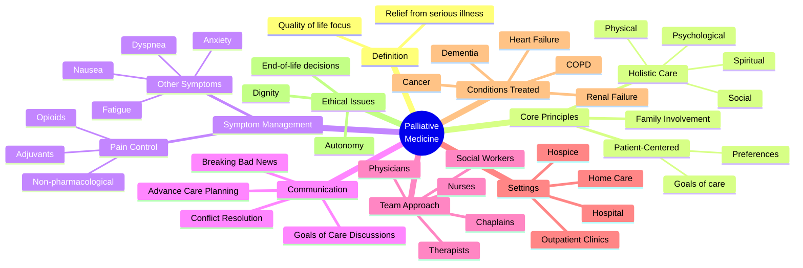

```mermaid
mindmap
  root((Palliative<br/>Medicine))
    Definition
      Relief from serious illness
      Quality of life focus
    Core Principles
      Holistic Care
        Physical
        Psychological
        Social
        Spiritual
      Patient-Centered
        Goals of care
        Preferences
      Family Involvement
    Symptom Management
      Pain Control
        Opioids
        Adjuvants
        Non-pharmacological
      Other Symptoms
        Nausea
        Dyspnea
        Fatigue
        Anxiety
    Communication
      Advance Care Planning
      Goals of Care Discussions
      Breaking Bad News
      Conflict Resolution
    Team Approach
      Physicians
      Nurses
      Social Workers
      Chaplains
      Therapists
    Settings
      Hospital
      Hospice
      Home Care
      Outpatient Clinics
    Conditions Treated
      Cancer
      Heart Failure
      COPD
      Dementia
      Renal Failure
    Ethical Issues
      End-of-life decisions
      Autonomy
      Dignity
```

