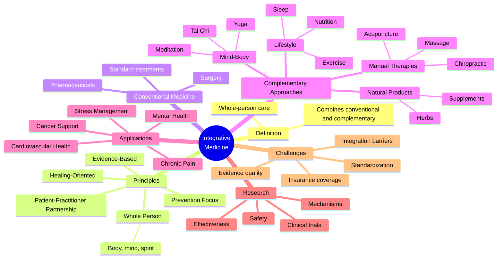

```mermaid
mindmap
  root((Integrative<br/>Medicine))
    Definition
      Combines conventional and complementary
      Whole-person care
    Principles
      Patient-Practitioner Partnership
      Evidence-Based
      Healing-Oriented
      Whole Person
        Body, mind, spirit
      Prevention Focus
    Conventional Medicine
      Pharmaceuticals
      Surgery
      Standard treatments
    Complementary Approaches
      Mind-Body
        Meditation
        Yoga
        Tai Chi
      Natural Products
        Herbs
        Supplements
      Manual Therapies
        Massage
        Chiropractic
        Acupuncture
      Lifestyle
        Nutrition
        Exercise
        Sleep
    Applications
      Chronic Pain
      Stress Management
      Cancer Support
      Cardiovascular Health
      Mental Health
    Research
      Clinical trials
      Mechanisms
      Safety
      Effectiveness
    Challenges
      Evidence quality
      Insurance coverage
      Standardization
      Integration barriers
```

