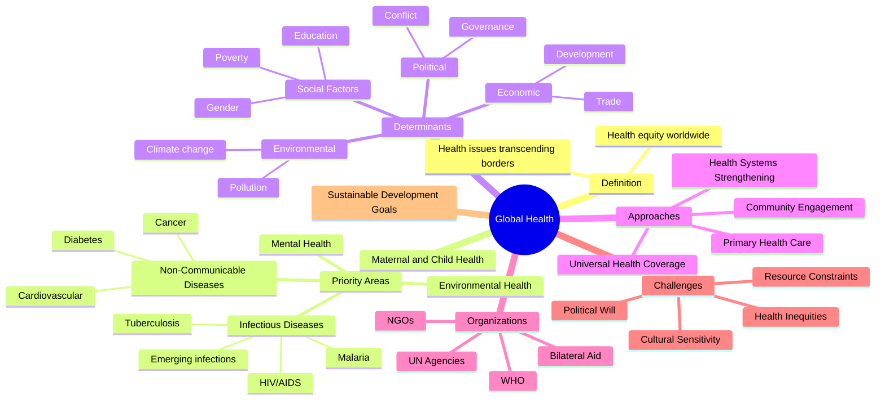

```mermaid
mindmap
  root((Global Health))
    Definition
      Health issues transcending borders
      Health equity worldwide
    Priority Areas
      Infectious Diseases
        HIV/AIDS
        Malaria
        Tuberculosis
        Emerging infections
      Non-Communicable Diseases
        Cardiovascular
        Cancer
        Diabetes
      Maternal and Child Health
      Mental Health
      Environmental Health
    Determinants
      Social Factors
        Poverty
        Education
        Gender
      Political
        Governance
        Conflict
      Economic
        Trade
        Development
      Environmental
        Climate change
        Pollution
    Approaches
      Primary Health Care
      Universal Health Coverage
      Health Systems Strengthening
      Community Engagement
    Organizations
      WHO
      UN Agencies
      NGOs
      Bilateral Aid
    Challenges
      Health Inequities
      Resource Constraints
      Political Will
      Cultural Sensitivity
    Sustainable Development Goals
```

