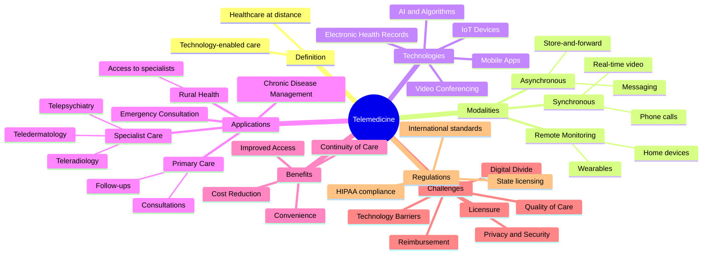

```mermaid
mindmap
  root((Telemedicine))
    Definition
      Healthcare at distance
      Technology-enabled care
    Modalities
      Synchronous
        Real-time video
        Phone calls
      Asynchronous
        Store-and-forward
        Messaging
      Remote Monitoring
        Wearables
        Home devices
    Technologies
      Video Conferencing
      Mobile Apps
      Electronic Health Records
      AI and Algorithms
      IoT Devices
    Applications
      Primary Care
        Consultations
        Follow-ups
      Specialist Care
        Teledermatology
        Telepsychiatry
        Teleradiology
      Rural Health
        Access to specialists
      Chronic Disease Management
      Emergency Consultation
    Benefits
      Improved Access
      Convenience
      Cost Reduction
      Continuity of Care
    Challenges
      Technology Barriers
      Digital Divide
      Privacy and Security
      Licensure
      Reimbursement
      Quality of Care
    Regulations
      HIPAA compliance
      State licensing
      International standards
```

