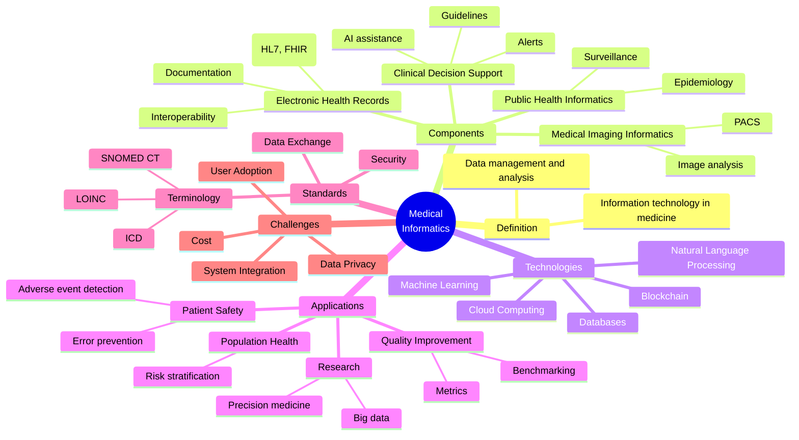

```mermaid
mindmap
  root((Medical<br/>Informatics))
    Definition
      Information technology in medicine
      Data management and analysis
    Components
      Electronic Health Records
        Documentation
        Interoperability
        Standards (HL7, FHIR)
      Clinical Decision Support
        Alerts
        Guidelines
        AI assistance
      Medical Imaging Informatics
        PACS
        Image analysis
      Public Health Informatics
        Surveillance
        Epidemiology
    Technologies
      Databases
      Cloud Computing
      Machine Learning
      Natural Language Processing
      Blockchain
    Applications
      Quality Improvement
        Metrics
        Benchmarking
      Research
        Big data
        Precision medicine
      Patient Safety
        Error prevention
        Adverse event detection
      Population Health
        Risk stratification
    Standards
      Terminology
        SNOMED CT
        ICD
        LOINC
      Data Exchange
      Security
    Challenges
      Data Privacy
      System Integration
      User Adoption
      Cost
```

