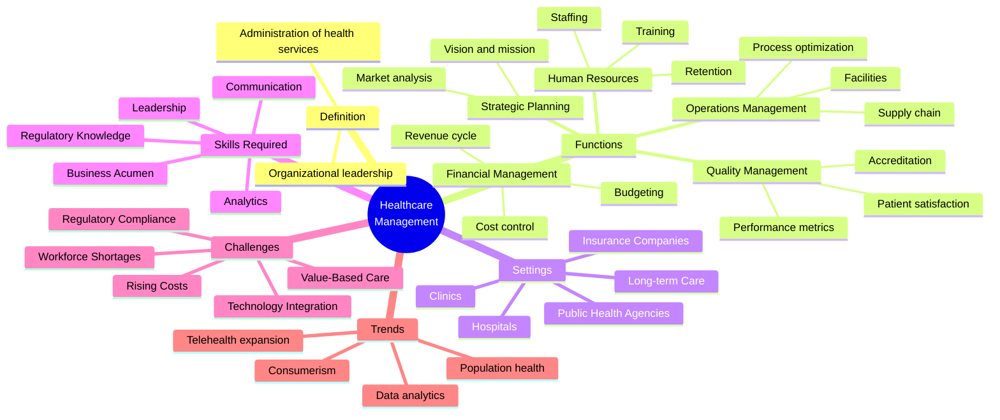

```mermaid
mindmap
  root((Healthcare<br/>Management))
    Definition
      Administration of health services
      Organizational leadership
    Functions
      Strategic Planning
        Vision and mission
        Market analysis
      Financial Management
        Budgeting
        Revenue cycle
        Cost control
      Operations Management
        Process optimization
        Supply chain
        Facilities
      Human Resources
        Staffing
        Training
        Retention
      Quality Management
        Performance metrics
        Accreditation
        Patient satisfaction
    Settings
      Hospitals
      Clinics
      Long-term Care
      Insurance Companies
      Public Health Agencies
    Skills Required
      Leadership
      Communication
      Analytics
      Regulatory Knowledge
      Business Acumen
    Challenges
      Rising Costs
      Workforce Shortages
      Technology Integration
      Regulatory Compliance
      Value-Based Care
    Trends
      Telehealth expansion
      Consumerism
      Data analytics
      Population health
```

