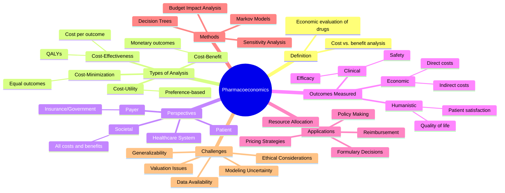

```mermaid
mindmap
  root((Pharmacoeconomics))
    Definition
      Economic evaluation of drugs
      Cost vs. benefit analysis
    Types of Analysis
      Cost-Effectiveness
        Cost per outcome
        QALYs
      Cost-Utility
        Preference-based
      Cost-Benefit
        Monetary outcomes
      Cost-Minimization
        Equal outcomes
    Perspectives
      Societal
        All costs and benefits
      Payer
        Insurance/Government
      Healthcare System
      Patient
    Outcomes Measured
      Clinical
        Efficacy
        Safety
      Economic
        Direct costs
        Indirect costs
      Humanistic
        Quality of life
        Patient satisfaction
    Applications
      Formulary Decisions
      Reimbursement
      Pricing Strategies
      Resource Allocation
      Policy Making
    Methods
      Decision Trees
      Markov Models
      Budget Impact Analysis
      Sensitivity Analysis
    Challenges
      Data Availability
      Modeling Uncertainty
      Valuation Issues
      Generalizability
      Ethical Considerations
```

