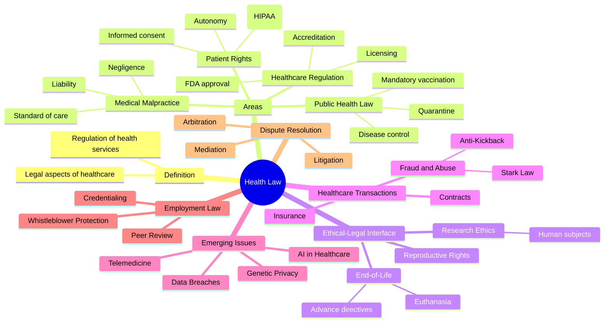

```mermaid
mindmap
  root((Health Law))
    Definition
      Legal aspects of healthcare
      Regulation of health services
    Areas
      Medical Malpractice
        Standard of care
        Negligence
        Liability
      Patient Rights
        Informed consent
        Privacy (HIPAA)
        Autonomy
      Healthcare Regulation
        Licensing
        Accreditation
        FDA approval
      Public Health Law
        Disease control
        Quarantine
        Mandatory vaccination
    Ethical-Legal Interface
      End-of-Life
        Advance directives
        Euthanasia
      Reproductive Rights
      Research Ethics
        Human subjects
    Healthcare Transactions
      Contracts
      Insurance
      Fraud and Abuse
        Stark Law
        Anti-Kickback
    Emerging Issues
      Telemedicine
      AI in Healthcare
      Genetic Privacy
      Data Breaches
    Employment Law
      Credentialing
      Peer Review
      Whistleblower Protection
    Dispute Resolution
      Mediation
      Arbitration
      Litigation
```

