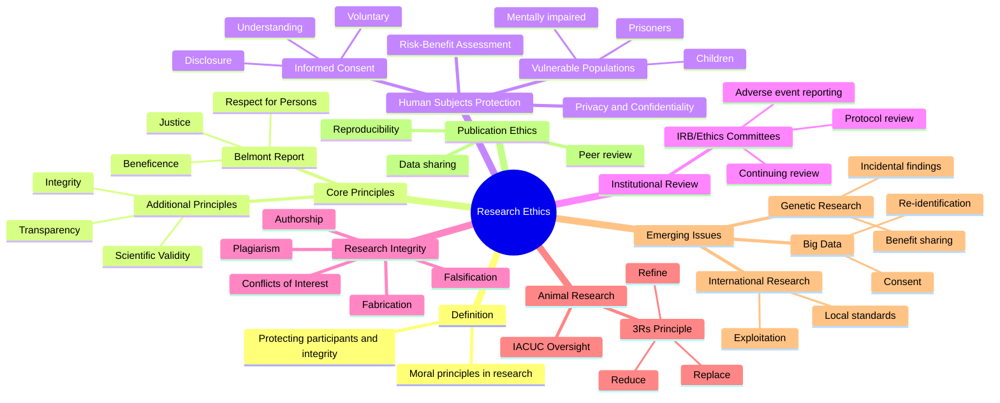

```mermaid
mindmap
  root((Research Ethics))
    Definition
      Moral principles in research
      Protecting participants and integrity
    Core Principles
      Belmont Report
        Respect for Persons
        Beneficence
        Justice
      Additional Principles
        Scientific Validity
        Integrity
        Transparency
    Human Subjects Protection
      Informed Consent
        Voluntary
        Understanding
        Disclosure
      Risk-Benefit Assessment
      Vulnerable Populations
        Children
        Prisoners
        Mentally impaired
      Privacy and Confidentiality
    Institutional Review
      IRB/Ethics Committees
        Protocol review
        Continuing review
        Adverse event reporting
    Research Integrity
      Fabrication
      Falsification
      Plagiarism
      Authorship
      Conflicts of Interest
    Animal Research
      3Rs Principle
        Replace
        Reduce
        Refine
      IACUC Oversight
    Emerging Issues
      Big Data
        Consent
        Re-identification
      Genetic Research
        Incidental findings
        Benefit sharing
      International Research
        Local standards
        Exploitation
    Publication Ethics
      Peer review
      Data sharing
      Reproducibility
```

