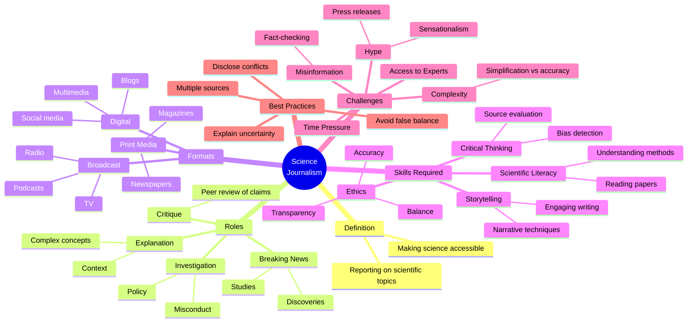

```mermaid
mindmap
  root((Science<br/>Journalism))
    Definition
      Reporting on scientific topics
      Making science accessible
    Roles
      Breaking News
        Discoveries
        Studies
      Explanation
        Complex concepts
        Context
      Investigation
        Misconduct
        Policy
      Critique
        Peer review of claims
    Formats
      Print Media
        Newspapers
        Magazines
      Broadcast
        TV
        Radio
        Podcasts
      Digital
        Blogs
        Social media
        Multimedia
    Skills Required
      Scientific Literacy
        Understanding methods
        Reading papers
      Critical Thinking
        Source evaluation
        Bias detection
      Storytelling
        Narrative techniques
        Engaging writing
      Ethics
        Accuracy
        Balance
        Transparency
    Challenges
      Complexity
        Simplification vs accuracy
      Hype
        Sensationalism
        Press releases
      Misinformation
        Fact-checking
      Time Pressure
      Access to Experts
    Best Practices
      Multiple sources
      Avoid false balance
      Disclose conflicts
      Explain uncertainty
```

