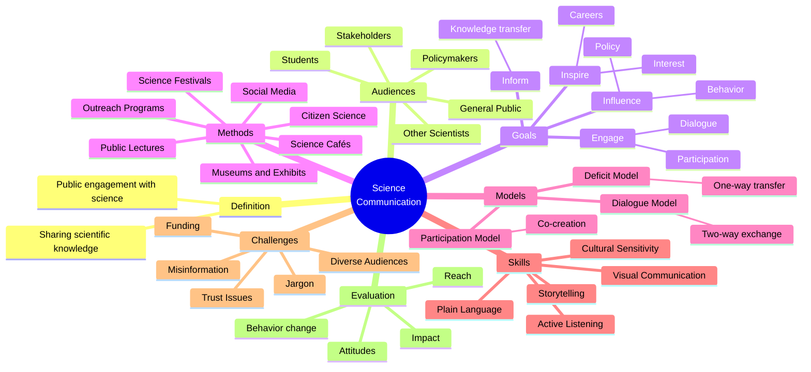

```mermaid
mindmap
  root((Science<br/>Communication))
    Definition
      Sharing scientific knowledge
      Public engagement with science
    Audiences
      General Public
      Policymakers
      Students
      Stakeholders
      Other Scientists
    Goals
      Inform
        Knowledge transfer
      Engage
        Dialogue
        Participation
      Inspire
        Interest
        Careers
      Influence
        Policy
        Behavior
    Methods
      Public Lectures
      Science Festivals
      Museums and Exhibits
      Social Media
      Citizen Science
      Science Cafés
      Outreach Programs
    Models
      Deficit Model
        One-way transfer
      Dialogue Model
        Two-way exchange
      Participation Model
        Co-creation
    Skills
      Storytelling
      Visual Communication
      Plain Language
      Active Listening
      Cultural Sensitivity
    Challenges
      Trust Issues
      Misinformation
      Jargon
      Diverse Audiences
      Funding
    Evaluation
      Reach
      Impact
      Behavior change
      Attitudes
```

