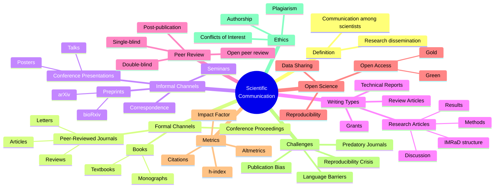

```mermaid
mindmap
  root((Scientific<br/>Communication))
    Definition
      Communication among scientists
      Research dissemination
    Formal Channels
      Peer-Reviewed Journals
        Articles
        Reviews
        Letters
      Books
        Monographs
        Textbooks
      Conference Proceedings
    Informal Channels
      Preprints
        arXiv
        bioRxiv
      Conference Presentations
        Talks
        Posters
      Seminars
      Correspondence
    Writing Types
      Research Articles
        IMRaD structure
        Methods
        Results
        Discussion
      Review Articles
      Grants
      Technical Reports
    Peer Review
      Single-blind
      Double-blind
      Open peer review
      Post-publication
    Open Science
      Open Access
        Gold
        Green
      Data Sharing
      Reproducibility
    Metrics
      Citations
      Impact Factor
      h-index
      Altmetrics
    Challenges
      Publication Bias
      Predatory Journals
      Reproducibility Crisis
      Language Barriers
    Ethics
      Authorship
      Plagiarism
      Conflicts of Interest
```

