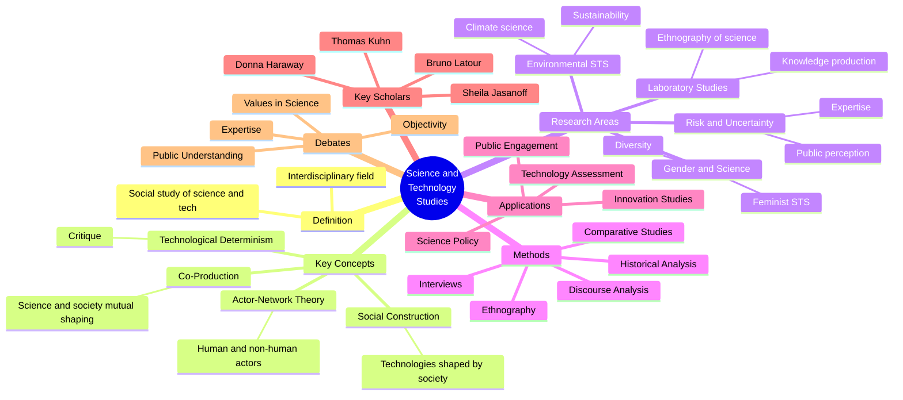

```mermaid
mindmap
  root((Science and<br/>Technology<br/>Studies))
    Definition
      Social study of science and tech
      Interdisciplinary field
    Key Concepts
      Social Construction
        Technologies shaped by society
      Actor-Network Theory
        Human and non-human actors
      Technological Determinism
        Critique
      Co-Production
        Science and society mutual shaping
    Research Areas
      Laboratory Studies
        Ethnography of science
        Knowledge production
      Risk and Uncertainty
        Public perception
        Expertise
      Gender and Science
        Feminist STS
        Diversity
      Environmental STS
        Climate science
        Sustainability
    Methods
      Ethnography
      Discourse Analysis
      Historical Analysis
      Comparative Studies
      Interviews
    Applications
      Science Policy
      Technology Assessment
      Public Engagement
      Innovation Studies
    Key Scholars
      Bruno Latour
      Donna Haraway
      Sheila Jasanoff
      Thomas Kuhn
    Debates
      Objectivity
      Public Understanding
      Expertise
      Values in Science
```

