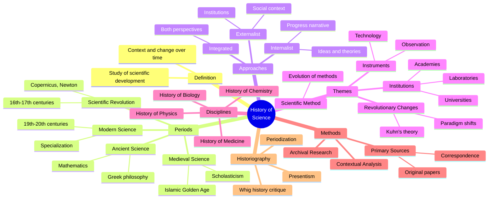

```mermaid
mindmap
  root((History of<br/>Science))
    Definition
      Study of scientific development
      Context and change over time
    Periods
      Ancient Science
        Greek philosophy
        Mathematics
      Medieval Science
        Islamic Golden Age
        Scholasticism
      Scientific Revolution
        16th-17th centuries
        Copernicus, Newton
      Modern Science
        19th-20th centuries
        Specialization
    Approaches
      Internalist
        Ideas and theories
        Progress narrative
      Externalist
        Social context
        Institutions
      Integrated
        Both perspectives
    Themes
      Scientific Method
        Evolution of methods
      Institutions
        Universities
        Academies
        Laboratories
      Instruments
        Technology
        Observation
      Revolutionary Changes
        Paradigm shifts
        Kuhn's theory
    Disciplines
      History of Physics
      History of Biology
      History of Chemistry
      History of Medicine
    Methods
      Primary Sources
        Original papers
        Correspondence
      Archival Research
      Contextual Analysis
    Historiography
      Whig history critique
      Presentism
      Periodization
```

