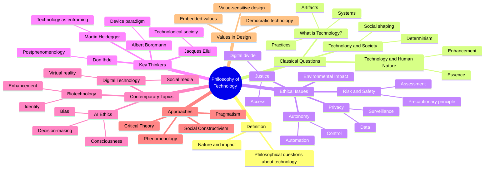

```mermaid
mindmap
  root((Philosophy of<br/>Technology))
    Definition
      Philosophical questions about technology
      Nature and impact
    Classical Questions
      What is Technology?
        Artifacts
        Systems
        Practices
      Technology and Human Nature
        Enhancement
        Essence
      Technology and Society
        Determinism
        Social shaping
    Ethical Issues
      Risk and Safety
        Assessment
        Precautionary principle
      Privacy
        Surveillance
        Data
      Autonomy
        Automation
        Control
      Justice
        Access
        Digital divide
      Environmental Impact
    Key Thinkers
      Martin Heidegger
        Technology as enframing
      Jacques Ellul
        Technological society
      Don Ihde
        Postphenomenology
      Albert Borgmann
        Device paradigm
    Contemporary Topics
      AI Ethics
        Decision-making
        Bias
        Consciousness
      Biotechnology
        Enhancement
        Identity
      Digital Technology
        Virtual reality
        Social media
    Approaches
      Phenomenology
      Social Constructivism
      Critical Theory
      Pragmatism
    Values in Design
      Value-sensitive design
      Embedded values
      Democratic technology
```

