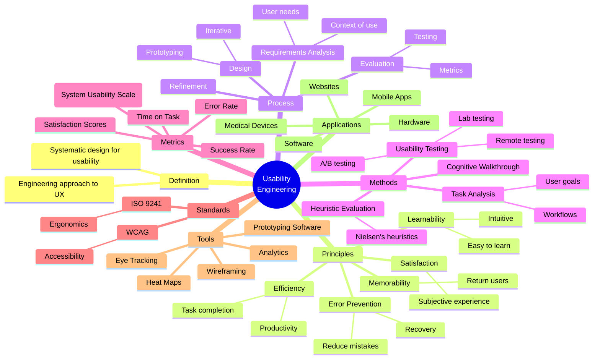

```mermaid
mindmap
  root((Usability<br/>Engineering))
    Definition
      Systematic design for usability
      Engineering approach to UX
    Principles
      Learnability
        Easy to learn
        Intuitive
      Efficiency
        Productivity
        Task completion
      Memorability
        Return users
      Error Prevention
        Reduce mistakes
        Recovery
      Satisfaction
        Subjective experience
    Process
      Requirements Analysis
        User needs
        Context of use
      Design
        Iterative
        Prototyping
      Evaluation
        Testing
        Metrics
      Refinement
    Methods
      Task Analysis
        User goals
        Workflows
      Heuristic Evaluation
        Nielsen's heuristics
      Cognitive Walkthrough
      Usability Testing
        Lab testing
        Remote testing
        A/B testing
    Metrics
      Time on Task
      Success Rate
      Error Rate
      Satisfaction Scores
      SUS (System Usability Scale)
    Standards
      ISO 9241
        Ergonomics
      WCAG
        Accessibility
    Tools
      Wireframing
      Prototyping Software
      Analytics
      Eye Tracking
      Heat Maps
    Applications
      Software
      Websites
      Mobile Apps
      Hardware
      Medical Devices
```

