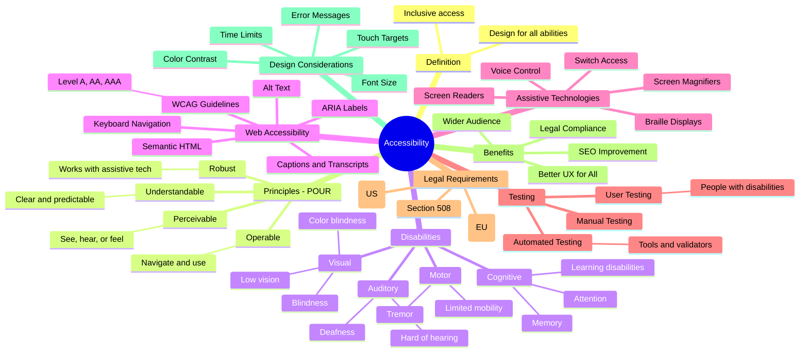

```mermaid
mindmap
  root((Accessibility))
    Definition
      Design for all abilities
      Inclusive access
    Principles - POUR
      Perceivable
        See, hear, or feel
      Operable
        Navigate and use
      Understandable
        Clear and predictable
      Robust
        Works with assistive tech
    Disabilities
      Visual
        Blindness
        Low vision
        Color blindness
      Auditory
        Deafness
        Hard of hearing
      Motor
        Limited mobility
        Tremor
      Cognitive
        Learning disabilities
        Memory
        Attention
    Web Accessibility
      WCAG Guidelines
        Level A, AA, AAA
      Semantic HTML
      Alt Text
      Keyboard Navigation
      ARIA Labels
      Captions and Transcripts
    Assistive Technologies
      Screen Readers
      Screen Magnifiers
      Voice Control
      Switch Access
      Braille Displays
    Testing
      Automated Testing
        Tools and validators
      Manual Testing
      User Testing
        People with disabilities
    Legal Requirements
      ADA (US)
      Section 508
      EN 301 549 (EU)
    Benefits
      Wider Audience
      Better UX for All
      SEO Improvement
      Legal Compliance
    Design Considerations
      Color Contrast
      Font Size
      Touch Targets
      Error Messages
      Time Limits
```

