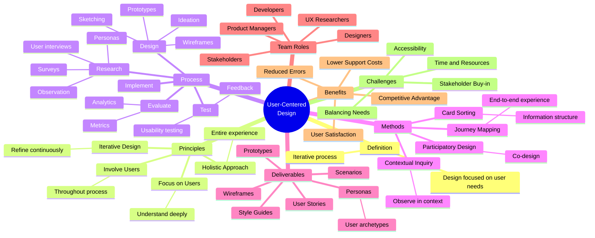

```mermaid
mindmap
  root((User-Centered<br/>Design))
    Definition
      Design focused on user needs
      Iterative process
    Principles
      Focus on Users
        Understand deeply
      Involve Users
        Throughout process
      Iterative Design
        Refine continuously
      Holistic Approach
        Entire experience
    Process
      Research
        User interviews
        Observation
        Surveys
        Personas
      Design
        Ideation
        Sketching
        Wireframes
        Prototypes
      Test
        Usability testing
        Feedback
      Implement
      Evaluate
        Metrics
        Analytics
    Methods
      Contextual Inquiry
        Observe in context
      Participatory Design
        Co-design
      Card Sorting
        Information structure
      Journey Mapping
        End-to-end experience
    Deliverables
      Personas
        User archetypes
      Scenarios
      User Stories
      Wireframes
      Prototypes
      Style Guides
    Team Roles
      UX Researchers
      Designers
      Developers
      Product Managers
      Stakeholders
    Benefits
      User Satisfaction
      Reduced Errors
      Lower Support Costs
      Competitive Advantage
    Challenges
      Time and Resources
      Stakeholder Buy-in
      Balancing Needs
      Accessibility
```

